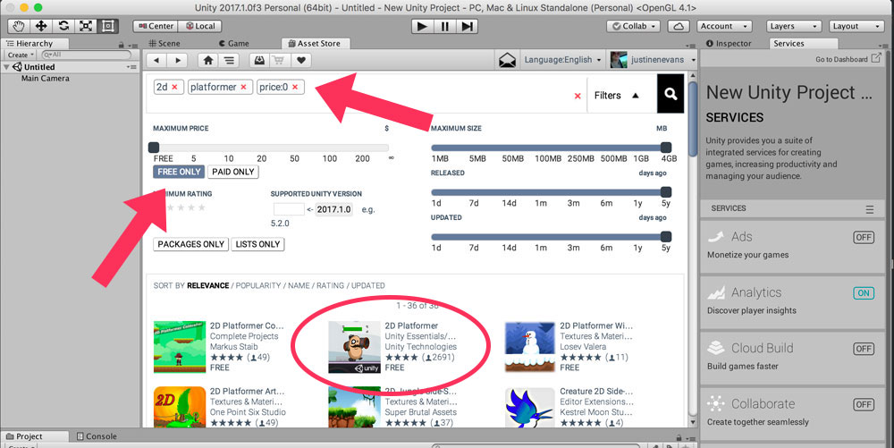

## Module 3 / Game Development
### Creating a 2D Platfomer Game with the Unity Engine
/ / / 
/ / / 
/ / / 
/ / /

Project 3

Games

This last module is a all about game design, and working in a game engine to create a 2D platformer from the ground-up.

When it comes to engines, it's best to get your hands on one and learn within the interface as you go along. This means jumping in head-first, as terrifying as that sounds. It's easy to get overwhelmed, but don't worry - we're here to help you on this journey!

### Unity:  Easy to get. Easy to learn. Easy to share.

Unity is the leading global game industry software, with a gamer audience of nearly 800 million and producing 34% of all top games. What interests us is its low learning curve and beginner-friendly set of tools, tutorials, and communities.

For us specifically, we going to look at and create a **2-Dimensional Platfomer** game, using assets, scripts, and perseverance.

#### Optional Example Project

A great way to get comfortable in Unity, is to explore a finished project.

You can download 2D assets for character controllers, camera scripts, sprites and sprites sheets, and even whole completed games. Downloading a completed game, such as _[Tower Bridge Defense](https://www.assetstore.unity3d.com/en/#!/content/11228)_, can be helpful in seeing how a game is put together. Some of the items in the asset store are commercial and will vary in pricey, but everything you need to get up and running making 2D games in Unity is **completely free**.

A [full tutorial](https://unity3d.com/learn/tutorials/s/2d-game-creation) for _Tower Bridge Defense_ is provided, inlcuding this beginning overview:

<iframe class="embed-responsive-item" src="https://www.youtube.com/embed/4qE8cuHI93c?rel=0" frameborder="0" allowfullscreen></iframe>

<a href="https://www.youtube.com/watch?v=4qE8cuHI93c" target="_blank"><i>View Larger</i></a>

**NOTE:** If you are unable to get the asset download to work from your browser, open Unity, create a new 2D game, and in the Asset Store tab, filter your search by "2d", "platfomer", and select FREE ONLY.

