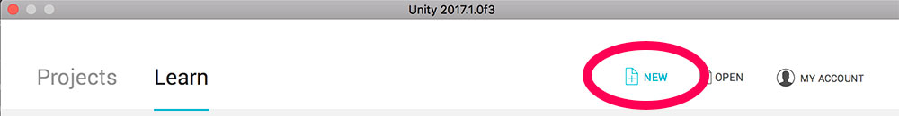
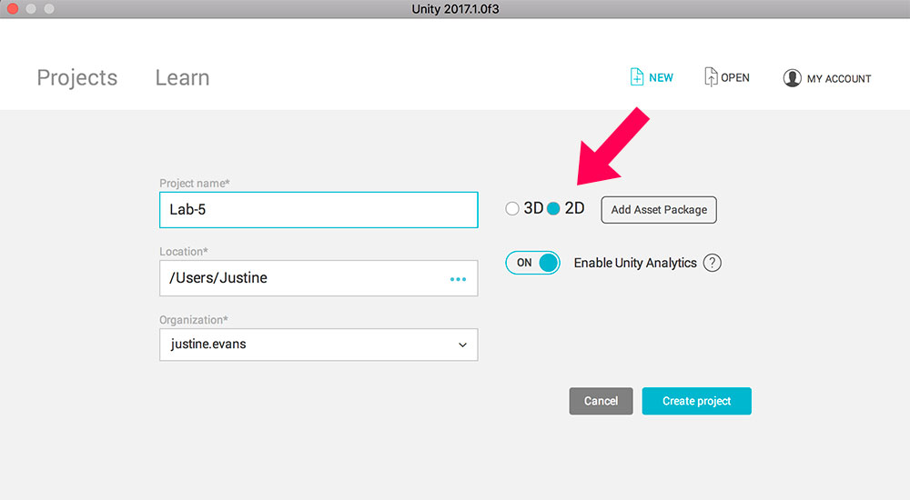

## Lab 05, Pt. I: Sprites and Characters
/ / / 
/ / / 
/ / / 
/ / /

**Approx. Time to Complete this Part:** 4 hours

Together with Unity 5, we're going to build a 2D Platformer starring a lone character in a fantastical world of **phsyics**, **collectable objects**, and **hazards!**

**NOTE:** Lab 5 spans four weeks. You will only turn in one assignment for this entire lab, at the very end (as your completed game). Take these tutorials at your own pace, moving on to Parts II, III, and IV when you're ready, but **_don't slack_** - pace yourself and plan ahead for harder sections which may require more of your time.

Part I, found below, will focus on importing and animating character sprites, and how that character is controlled within an enviroment.

### Getting Started
For this Lab, please follow-along with step-by-step tutorial provided below. There is no "on your own" section, unless you choose to explore more on your own time.

1. Download **Unity Personal** for Free from the [Unity Store](https://unity3d.com/get-unity).
2. Open Unity and create a Unity ID, if you haven't already.
3. Sign in.
4. Select "New" from the top menu.
    
5. Name your project (for example "Lab-5"), select a location, and make sure you toggle to **2D**:
    

### Follow Along

Download the character controller script and the Rantler sprite sheets discussed in these video here: [game-assets-1.zip](../files/game-assets-1.zip)

#### / 2D Game with Scripts Part 1 (08:12)

<iframe class="embed-responsive-item" src="https://www.youtube.com/embed/w4_XQexgiuI?rel=0" frameborder="0" allowfullscreen></iframe>

<a href="https://www.youtube.com/watch?v=w4_XQexgiuI&list=PLGpqh3JS7l9LJMq8BAR0f-0qVYXggEc5z&index=1" target="_blank"><i>View in Playlist</i></a>

#### / 2D Game with Scripts Part 2 (02:39)

<iframe class="embed-responsive-item" src="https://www.youtube.com/embed/YSNpVedidu4?rel=0" frameborder="0" allowfullscreen></iframe>

<a href="https://www.youtube.com/watch?v=YSNpVedidu4&index=2&list=PLGpqh3JS7l9LJMq8BAR0f-0qVYXggEc5z" target="_blank"><i>View in Playlist</i></a>

#### / 2D Game with Scripts Part 3 (05:47)

<iframe class="embed-responsive-item" src="https://www.youtube.com/embed/3NQndxPv4ko?rel=0" frameborder="0" allowfullscreen></iframe>

<a href="https://www.youtube.com/watch?v=3NQndxPv4ko&index=3&list=PLGpqh3JS7l9LJMq8BAR0f-0qVYXggEc5z" target="_blank"><i>View in Playlist</i></a>

#### / 2D Game with Scripts 4 (07:20)

<iframe class="embed-responsive-item" src="https://www.youtube.com/embed/WdGZ-x3cMQI?rel=0" frameborder="0" allowfullscreen></iframe>

<a href="https://www.youtube.com/watch?v=WdGZ-x3cMQI&list=PLGpqh3JS7l9LJMq8BAR0f-0qVYXggEc5z&index=4" target="_blank"><i>View in Playlist</i></a>

#### / 2D Game with Scripts 5 (04:12)

<iframe class="embed-responsive-item" src="https://www.youtube.com/embed/gr5-qjp9zAg?rel=0" frameborder="0" allowfullscreen></iframe>

<a href="https://www.youtube.com/watch?v=gr5-qjp9zAg&index=5&list=PLGpqh3JS7l9LJMq8BAR0f-0qVYXggEc5z" target="_blank"><i>View in Playlist</i></a>

