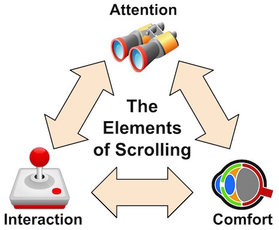
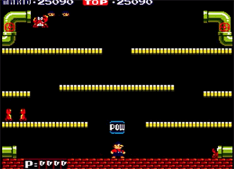
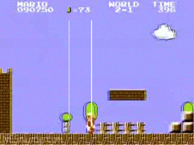
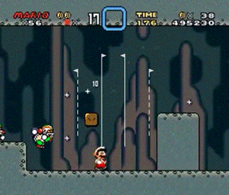

## Camera, and Following Action:
/ / / 
/ / / 
/ / / 
/ / /

Most platformers, particularly early ones, use a scrolling game camera.

### Let's Define:
The following is cited from the article "[The Theory and Practice of Cameras in Side-Scrollers](https://www.gamasutra.com/blogs/ItayKeren/20150511/243083/Scroll_Back_The_Theory_and_Practice_of_Cameras_in_SideScrollers.php)." It deals with the scrolling camera view, but there are many different [views and perspecitves](https://www.gamasutra.com/blogs/AnjinAnhut/20110410/89304/A_Look_inside__Evaluating_Camera_Angles_For_Immersion.php) used in game design.

#### Scrolling
"Scrolling or Panning refers to any attempt to display a scene that is larger than what fits in a single screen. There are many potential challenges with scrolling, like choosing what the player needs to see, what we as designers would like the player to focus on, and how to do it in a way that’s fluid and comfortable for the player."

#### Attention, Interaction, and Comfort

<ul>
<li>"<i>Attention:</i> Use the camera to provide sufficient game info and feedback (what the player needs to see);</li>
<li><i>Interaction:</i> Provide clear player control on what’s displayed, make background changes predictable and tightly bound to controls (what the player wants to see);</li>
<li><i>Comfort:</i> Ease and contextualize background changes (how to reconcile those needs smoothly and comfortably)."</li>
</ul>

#### In Practice: _Mario's_ Camera Motion Through the Ages
Side scrollers can have many different tracking tricks. "Keep attention on your control subject." This is usually the main character, but not always solely, as you'll see with _Mario_.
  

<h5 style="margin-top: 0;"><i>Mario Bros.</i> (1983)</h5>

<b>Camera Shake:</b> an example of disconnection between the camera and the controls, as achieved by a camera/screen shake, which provides a sense of drama to the action.

<h5 style="margin-top: 0;"><i>Super Mario Bros.</i> (1985)</h5>

<b>Speedup-Push-Zone:</b> when inside the push-zone, gradually accelerate the camera to catch up with player’s speed.

<h5 style="margin: 0 0 1em 0;"><i>Super Mario World</i> (1990)</h5>

<h6 style="margin-top: 0;">Adding Environment:</h6>

<b>Platform-Snapping:</b> camera snaps to the player only as it lands on a platform.

<h6 style="margin-top: 0;">Other Innovations:</h6>

<b>Camera-Window:</b> push camera position as the player hits the window edge

<b>Region-Based-Anchors:</b> different regions (even within levels) set different anchors for position and focus

<b>Dual-Forward-Focus:</b> player direction changes switch camera focus to enable wide forward view

<b>Manual-Control:</b> controller provides extra panning (horizontally).

<iframe class="embed-responsive-item" src="https://www.youtube.com/embed/TCIMPYM0AQg?rel=0" frameborder="0" allowfullscreen></iframe>

