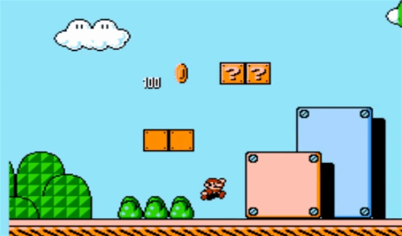

## Game Forces:
/ / / 
/ / / 
/ / / 
/ / /

### Let's Define:

#### Mechanics
Game **mechanics** is an abstract concept used to describe the core fundamentals of the game's design. Most easily defined, mechanics are the "verbs" of the game; the things you _do_, like jumping, shooting, or puzzle-solving (and all the associated tasks).

But this is a very simplistic way of looking at mechanics, and doesn't necessarily account for the weight attached to the _use_ of these verbs. For example, a character can jump, or he can jump to a reach a higher area, or avoid enemies. It is how we _use_ the jump mechanic that defines it. For example:

Another way of thinking about mechanics are as tools players must use to construct the game experience.

#### Physics
Continuing our example of jumping, many games play with physics and how certain factors effect the jump and its use. In _Mario_, if you take a running start, your jump will be both higher and longer, with a faster frame rate on the fall.

You're working with joints in your Unity game, but physics most likely effect _everything_ in your game. Simply consider gravity, which has to be programmed into every game.

<iframe class="embed-responsive-item" src="https://player.vimeo.com/video/17987152?color=FC315A" frameborder="0" allowfullscreen></iframe>

