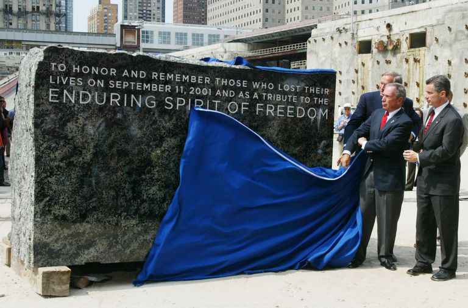
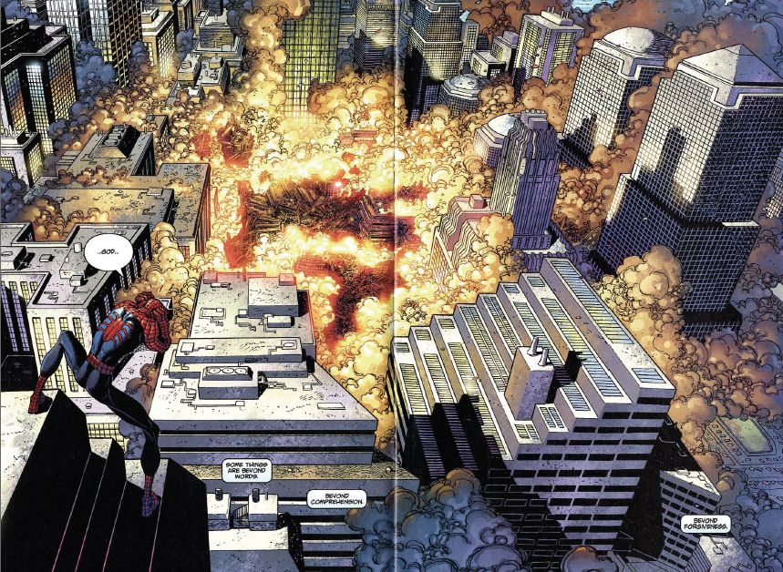

## 2 WTC:
/ / / 
/ / / 
/ / / 
/ / /

_The cornerstone of 1 World Trade Center, July 4, 2004._

When the Two Towers of the World Trade Center were destroyed in 2001, it rocked a nation previously thought untouchable to its core. Every form of media reacted to the event, and a people were on hold.

[_Spiderman Issue #36_](https://imgur.com/gallery/83xZp), Dec 2001.

The American Zeitgeist shifted, and radical changes were made to normal activites like travel, communication, and privacy.

### Reconstruction
<!--Reconstruction on the World Trade Center site was mired in difficulties from the beginning. Families of the victims rejected site plans, Groud Zero was filled with toxic dust, and a sagging economy diminished the need for large office buildings.-->

The architects who were brought in to rebuild were burdened with a diffiult task; taking New York's most hallowed site and creating towers that were respectful to the property's history, yet progressive and innovative. The original towers stood for economic power, and the new ones needed to as well; but they also needed to represent abstract concepts like unity, freedom, and community. It seemed an impossible task, and the projects passed between many hands.

The National 9/11 Memorial (_Reflecting Absence_) opened September 11, 2011, and 1 World Trade Center (_Freedom Tower_) followed suit in Novemeber of 2013. Other towers are still in construction, with 2 World Trade Center currently in the hands of architect Bjarke Ingels.

“We have tried to incorporate that duality,” Ingels said. “On one hand it’s about being respectful and about completing the frame around the memorial, and on the other hand it’s about revitalizing downtown Manhattan and making it a lively place to live and work.”

 

<iframe src="https://h5p.org/h5p/embed/117335" width="800" height="600" frameborder="0" allowfullscreen="allowfullscreen"></iframe>

Learn more about Bjarke Ingel's _design philosophy_ on the next page.
