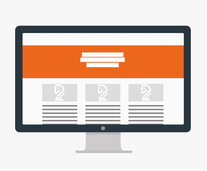

## Web/Site Architecture:
/ / / 
/ / / 
/ / / 
/ / /

### Web Architecture
Web Architecture focuses on the technologies and principles which sustain the Web, including URIs and HTTP. Its foundations lie in systematic and dependable server-client communication, and involves developing applications through additional fields, including data, storage, and networking.

Web architecture is a product of engineers and software developers. _Website_ architecture, however is on us as designers.

### Website Architecture
Web<b>site</b> architecture relates specifically to websites, and refers to the way websitse are structured to ensure business goals are met while delivering a great experience to users. The overall picture of a website’s architecture includes:

- usability
- interaction design
- user interface design
- information design
- web design
- graphic design
- content strategy ([Max Koh](https://blog.optimalworkshop.com/anatomy-website-website-architecture))

Web designers are responsible for organizing and presenting content in an engaging way. It is their job to to create the interface of the site, including its site map (blueprint), layout (framework), content (structure), and graphics (finishes).

In accomplish this in a feasible way and for the greatest audience possible, web designers follow **web standards** and **best practices**, as described in the video below.

<iframe class="embed-responsive-item" src="https://player.vimeo.com/video/234957396?color=FC315A&title=0&byline=0&portrait=0" frameborder="0" allowfullscreen></iframe>

<a href="https://player.vimeo.com/video/234957396?color=FC315A&title=0&byline=0&portrait=0" target="_blank"><i>View Larger</i></a>

### Terms to Know
You are expected to understand the following terms and their proper usage in web interaction design. You will discuss your design choices in your Project write-ups.

#### Responsive Web Design (RWD)
**RWD is considered an essential practice for most designers.**

<b>Responsive Web Design</b> is the "it" concept in current web design and development. The goal of RWD is to create responsive websites that provide optimal viewing experiences across devices (like desktop computers versus mobile phones). RWD relies on flexible grid and layout systems to organize content, and creates dynamic changes depending on the screen size and orienation of the device.

 

Example: The <a href="http://www.morehazards.com">More Hazards More Heroes</a> site combines animation, color, and information in multiple layouts across screen sizes, keeping the most distinctive elements in each and carefully collapsing others to provide engagement while keeping data consumption low for mobile.

#### Web Fonts
**Generally, a website's stylesheet uses 2-3 fonts at most.**

There are a handful of fonts which are available across all common systems. These fonts like Arial, Courier, and Times New Roman are **web-safe** because they are guaranteed to render for most viewers.

Plain **Web fonts**, in contrast, are fonts hosted from servers and linked inside the site intself, and are not called up by a device's operating system. [Adobe Typekit](https://typekit.com/), [Google Fonts](https://fonts.google.com/), and [FontSquirrel](https://www.fontsquirrel.com/) are common font repositories.

Designers will often link to a primary web font and a fallback web-safe font, should the primary not render as expected.

 

Example: Dutch site <a href="https://www.evert45.com/">Evert_45</a> is a web experience about a young boy living through 1945, who uses modern services like Instagram and YouTube to share his story.

<blockquote>“For the website we also wanted to share the whole story in one timeline for a broader audience. <a href="https://www.myfonts.com/fonts/bitstream/atf-bodoni/">Bodoni</a>, a historical font, was the right choice. And the contrast between the big round numbers with the small caps creates a beautiful historical feeling.  

“To connect to the Instagram and YouTube content, we used large typography guided by a voiceover at the start of each chapter, to create a seamless online story. And it all seems to be working. We reached an incredible 50 per cent of Dutch teens within two weeks.”</blockquote>

#### Color
**Gerenally, a website's style uses 3-6 colors at most.**

In web design, color is used for many reasons beyond mere branding. Color directs attention, provides personality, and establishes cohesion and flow.

Although you are not coding in this class, you should know that designers reference colors in 3 ways:
- Color name, `<style="color: red">`
- Decimal RGB, `<style="color: rgb(255,0,0)">`
- Hexadecimal RGB (hex), `<style="color: #FF0000">`

While hex is the primary way to state value on the web, RGB and color names are still widely-used for various reasons.

[Adobe Color](https://color.adobe.com/create/color-wheel), [Paletton](paletton.com), [ColourCode](http://www.colourco.de/), and [Material Design](https://material.io/color) from the video below are all excellent ways of teasing out a color palette. Material Design even offers a color accessibility checker.

<iframe class="embed-responsive-item" src="https://player.vimeo.com/video/236982237?color=FC315A&title=0&byline=0&portrait=0" frameborder="0" allowfullscreen></iframe>

<a href="https://player.vimeo.com/video/236982237?color=FC315A&title=0&byline=0&portrait=0" target="_blank"><i>View Larger</i></a>

 

Example: See how <a href="http://innovationprojectcanvas.com/">Innovation Project Canvas</a> uses a single color to create engaging linear flow.

#### Call to Actions
**Generally, every page has a Call-to-Action element on it.**

Most websites want something from a viewer. Designers use **call to action** (CTAs) elements to solicit these actions. The most widely-use CTA is the "clickable button," that when clicked provide actions ("Add to Cart") or leads to more information ("Read More"). Other examples are certain forms, subcription signups, social media buttons/widgets, and the newly popular "online chat popup."

CTAs are based in **states**, or reactions to user input. The state you're probably most aware of is the _hover_ or _mouseover_, where an element changes when your cursor touches it. But there are many other states, often these four:
- disabled or hidden
- normal
- focused (like _hover_) or active
- pressed (usually an animation occurs)

<iframe width="100%" height="200" src="//jsfiddle.net/Lt9c6kjo/14/embedded/result/?accentColor=FC315A" allowfullscreen="allowfullscreen" frameborder="0"></iframe>

There is a lot of planning that needs to go into using CTAs, including verbiage, placement, and design.

<iframe class="embed-responsive-item" src="https://player.vimeo.com/video/236984037?color=FC315A&title=0&byline=0&portrait=0" frameborder="0" allowfullscreen></iframe>

<a href="https://player.vimeo.com/video/236984037?color=FC315A&title=0&byline=0&portrait=0" target="_blank"><i>View Larger</i></a>

 

Example: German design company <a href="https://www.dunckelfeld.de/">Ducklefield</a> (in <a href="https://www.dunckelfeld.de/en/">English</a>) utilizes an animated background - one of the hardest elements to implement in web design do to its distracting qualities. How do you draw a viewer's eye from dynamic movement to static text?  

Contrast and consitancy. The video background is darkened, and contrasting white lines are used premptively to draw the eye to upcoming CTAs. The buttons themselves are simple and consistant, using fills on hover to grab and keep attention from the background.

#### Other Interactive Elements
There are many, many additional ways we interact with websites. Call to Actions are not the only objects that use states, for example. Hyperlinks, video playback, and gallery thumbnails can all have attached states, as you'll see in Lab 2.

Additionally, 'clicking' is just one way to provide input. Scrolling, dragging, touching, and even webcam feeds can illicit responses from web pages.

We will look at more interactive elements in the next Topic.
