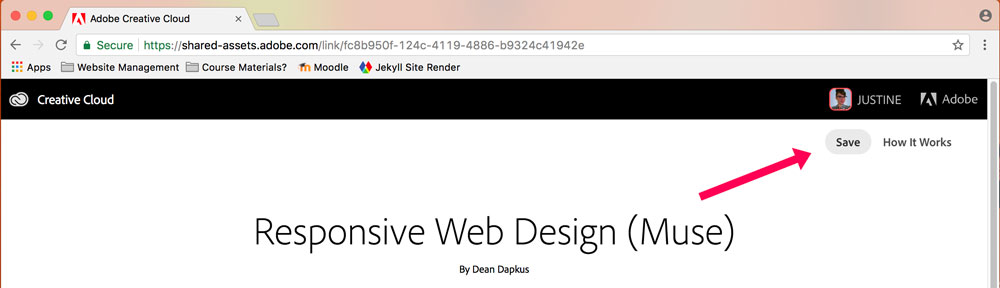
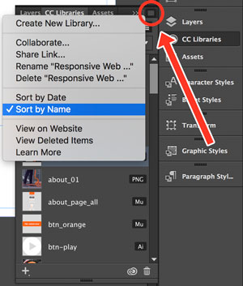
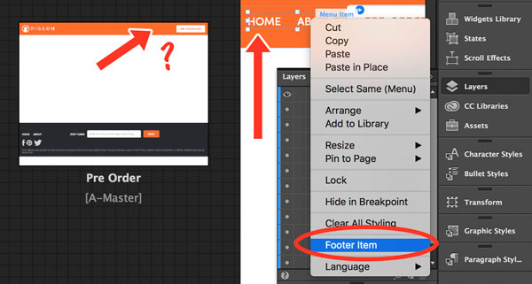
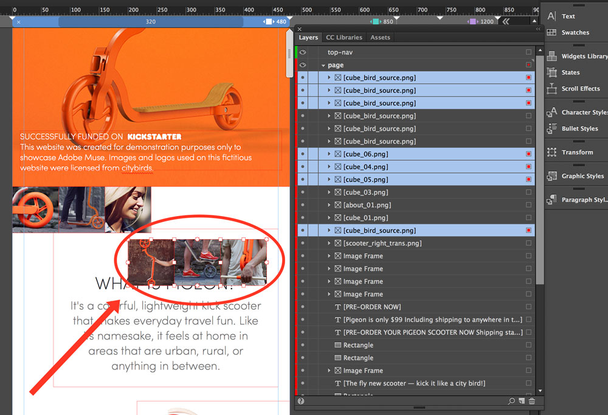
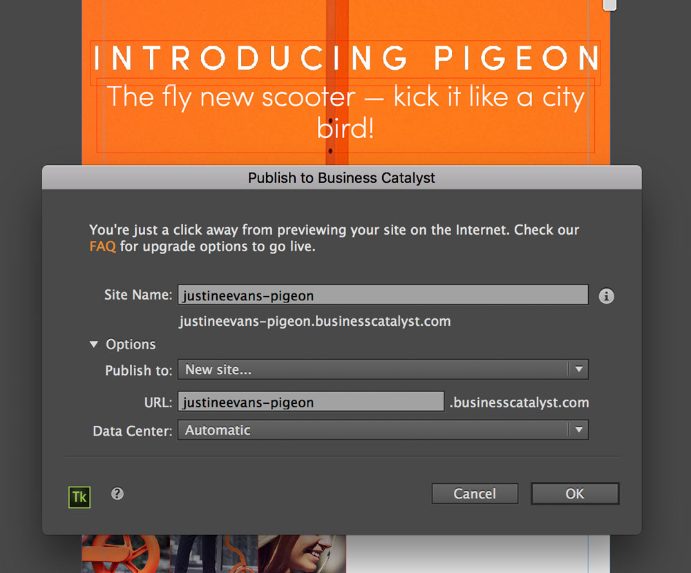

## Lab 02: Responsive Layout in Web Design
/ / / 
/ / / 
/ / / 
/ / /

**Approx. Time to Complete:** 1.5 hours

Together using Adobe Muse, we're going to build a product site for CITYBIRD's kick scooter, [the Pigeon](https://citybirds.lt/pigeon/). Following the design practices you just learned about, this page will be **responsive** and contain interactive objects with **states.**

This Lab will focus on web layout and architecture while explore the "Home" page. Next Lab, we'll look at dynamic elements and build this site's "About" and "Pre-Order" pages.

View a sample completed site here: [http://www.kickapigeon.com/index.html](http://www.kickapigeon.com/index.html)

<iframe src="//video.tv.adobe.com/v/14869/?learn=on&amp;delay=true&amp;quality=6" title="Video Player" class="video-iframe video-iframe-full-width" width="640" height="360" frameborder="0" webkitallowfullscreen="" mozallowfullscreen="" allowfullscreen="" scrolling="no"></iframe>
 Review responsive design (1:18); Access project files (2:48)

### Getting Started
For this Lab, please follow-along with the Part 1 step-by-step tutorial provided below. In Part 2 you will be asked to add an additional creative feature to make this project unique to you.

1. Sign into your [Adobe.com](https://accounts.adobe.com/) account.
2. Visit [the CC Library](https://shared-assets.adobe.com/link/fc8b950f-124c-4119-4886-b9324c41942e) for this project, which will provide you with all the assets needed to complete this lab. Select "Save" in the upper-right corner:

3. Open Adobe Muse and begin with Part 1.

### Part 1: Follow Along

#### / Build a Site Plan (05:06)
Create a new site, explore Plan mode, and get your site plan in place. Map out and name the pages you’ll build for your site, and then add page titles.

<iframe src="//video.tv.adobe.com/v/14870/?learn=on&amp;delay=true&amp;quality=6" title="Video Player" class="video-iframe video-iframe-full-width" width="640" height="360" frameborder="0" webkitallowfullscreen="" mozallowfullscreen="" allowfullscreen="" scrolling="no"></iframe>
 Lay out for web vs. print (00:20); Review final page design (2:10 ); Add pages to the site plan (2:27)

#### / Setup a Master Page (04:52)

Create a master page to hold parts of the design that you’ll use on every page of your website. Add the paragraph and graphic styles that you'll use throughout the website design.

<b>Note:</b> If you're having trouble locating assets, click this panels settings and choose "sort by name."

<iframe src="//video.tv.adobe.com/v/14871/?learn=on&amp;delay=true&amp;quality=6" title="Video Player" class="video-iframe video-iframe-full-width" width="640" height="360" frameborder="0" webkitallowfullscreen="" mozallowfullscreen="" allowfullscreen="" scrolling="no"></iframe>
 Open master page and review modules (00:18), Review Master page elements (00:55); Design Master page (1:25 ); Productivity tips (2:24)

#### / Create a Footer (07:30)
Create and style the website’s footer with responsive properties. Add icons for social media and define rollover states to provide a visual cue when users mouse over the icons. Associate the footer icons with hyperlinks to open other web pages from your site. Use the menu widget to define the navigation for your site. Finally, you will use another widget to add a form to the footer.

<iframe src="//video.tv.adobe.com/v/14872/?learn=on&amp;delay=true&amp;quality=6" title="Video Player" class="video-iframe video-iframe-full-width" width="640" height="360" frameborder="0" webkitallowfullscreen="" mozallowfullscreen="" allowfullscreen="" scrolling="no"></iframe>
 Define footer area (00:09); Add footer elements (00:39); Define rollover states (2:32); Add hyperlinks (4:03); Add navigation menu to footer (5:30); Add form to footer (7:02)

#### / Create a Header (04:00)
Create and style the website’s header with responsive properties. Add the site logo and a button and adjust the layout using alignment features. Add a menu to the header for site navigation and customize its appearance.

<iframe src="//video.tv.adobe.com/v/14873/?learn=on&amp;delay=true&amp;quality=6" title="Video Player" class="video-iframe video-iframe-full-width" width="640" height="360" frameborder="0" webkitallowfullscreen="" mozallowfullscreen="" allowfullscreen="" scrolling="no"></iframe>
 Define header area (00:12); Add header elements (00:31); Customize page menu navigation (1:42)

#### / Add Responsive Elements to the Master Page (09:53)
Use pinning and other responsive settings to ensure page elements will display as expected when the browser size changes across devices. Add breakpoints to your design to manage the transition between layouts when the browser changes size. Use the responsive tools to preview how your site will look in different layouts. Adjust page elements for optimal viewing at different breakpoints.

<iframe src="//video.tv.adobe.com/v/14874/?learn=on&amp;delay=true&amp;quality=6" title="Video Player" class="video-iframe video-iframe-full-width" width="640" height="360" frameborder="0" webkitallowfullscreen="" mozallowfullscreen="" allowfullscreen="" scrolling="no"></iframe>
 Pin elements for responsive layout (1:18); Preview design in browser (3:34); Add breakpoints (4:19); Reposition elements for different breakpoints (7:27)

**Note:** When you copy/paste or duplicate the "Home-About" footer menu, it might not show up on your pages when you click over to PLAN mode. We need to turn this duplicate menu off as footer menu. Back in DESIGN mode, right click on the asset group and make sure "Footer Item" is deselected.

#### / Add a Responsive Menu (08:27)
Design and lay out a menu that adapts for optimal display across desktop, tablet, and phone browsers. Learn how to structure the elements in the header and footer so that, as the menu layout changes from a wider desktop display to a smaller phone display, the items adjust accordingly.

<iframe src="//video.tv.adobe.com/v/14875/?learn=on&amp;delay=true&amp;quality=6" title="Video Player" class="video-iframe video-iframe-full-width" width="640" height="360" frameborder="0" webkitallowfullscreen="" mozallowfullscreen="" allowfullscreen="" scrolling="no"></iframe>
 Add touch-enabled menu (00:52); Structure page elements by creating layers (3:32); Show responsive menu only on tablet and phone layouts (5:29)

#### / Create a Layout for Mobile Display (04:26)
Add a breakpoint for a phone layout. Rearrange the page elements for a vertical layout for optimal display on phone browsers which have a narrower viewing area than desktop or tablet displays.

<iframe src="//video.tv.adobe.com/v/14876/?learn=on&amp;delay=true&amp;quality=6" title="Video Player" class="video-iframe video-iframe-full-width" width="640" height="360" frameborder="0" webkitallowfullscreen="" mozallowfullscreen="" allowfullscreen="" scrolling="no"></iframe>
 Optimize footer content for smaller layouts (1:02); Add breakpoint (3:00)

#### / Build the Home Page (10:19)
Complete the site’s Home page design. Fine-tune the layout by making adjustments to the text and images so the content resizes and scales correctly across browsers. Define additional rollover states to enhance the user’s experience as they navigate different parts of the page.

<iframe src="//video.tv.adobe.com/v/14877/?learn=on&amp;delay=true&amp;quality=6" title="Video Player" class="video-iframe video-iframe-full-width" width="640" height="360" frameborder="0" webkitallowfullscreen="" mozallowfullscreen="" allowfullscreen="" scrolling="no"></iframe>
 Define separate header and footer breakpoints (00:52); Add and review responsive home page elements (2:14); Review rollover state and scaling settings (7:19)

### Part 2: On Your Own
To complete this lab, please complete these following steps on your own:

#### / Ignore Additional Page Styles
At this time please _do not_ add the provided "About" and "Pre-Order" layouts to their pages. We will look at these two pages in your next Lab.

#### / Finish and Publish the Website (08:47)
The following video asks you to use a provided file to explain how you can design for mobile. But you're a Media Artist, and you don't need a stinking file.

Follow along visually with the video, but re-create all of the features she walks you through, including:

- Breakpoints for an individual page.
- Optimal display layouts (hide/show content).
- Scaling for smaller screens.

Finally, learn the options for sharing your site for review or publishing it live.

<iframe src="//video.tv.adobe.com/v/14878/?learn=on&amp;delay=true&amp;quality=6" title="Video Player" class="video-iframe video-iframe-full-width" width="640" height="360" frameborder="0" webkitallowfullscreen="" mozallowfullscreen="" allowfullscreen="" scrolling="no"></iframe>
 Review breakpoints (1:00 ); Adjust images for responsive layout (2:36 ); Format text across breakpoints (4:26); Publishing options (6:42)

**Note:** Objects with effects (like rollover states) are on multiple layers. To alter them together, you need to select them individually in the Layers panel, much like you would in Photoshop or Illustrator:

##### Publish
Please publish your site using Business Catalyst, using the formula **fullname-pigeon.businesscatalyst.com/**.

