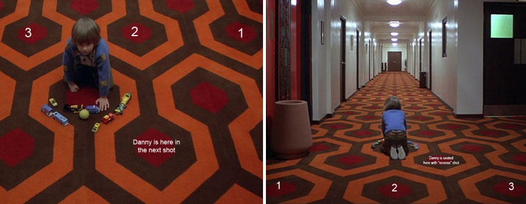
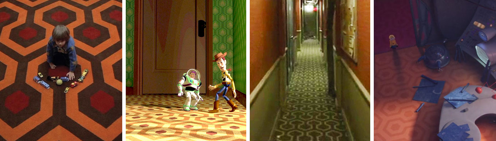

## Observing Spaces in Media:
/ / / 
/ / / 
/ / / 
/ / /

**Let's start by looking at spaces we _observe_ as viewers.** We can describe these as spaces that exist without our intervention, like art pieces or films. Tried-and-true design tools and methods are used to communicate complex ideas, often without words or dialogue. How? Well, let's talk about a pillar of visual language that many of you are already familiar with: pattern.

All design is based in patterns; searching for, finding, constructing, or <i>deconstructing</i>. While initially patterns may appear static (unmoving or flat), it's important to remember that pattern is one of the fundamental principles of design. This is also true of <a href="https://www.interaction-design.org/literature/article/repetition-pattern-and-rhythm" target="_blank">IxD</a>, where pattern, along with rhythm and repetition, are used to create meaning, direct attention, and even simulate motion. Unsuprisingly, pattern can be one of the most ingenious ways of indirect storytelling in the media arts.

Production and stage designers know this well. As many of you are filmmakers as well as designers, let's take a quick look at one of the most prolific filmmakers of the 20th century, who used pattern and perspective as his major method of creating atmosphere - Stanley Kubrick.

### The Psychology of Pattern

Kubrick's spaces were as much characters in his scripts as the actors. This is particularly present in _The Shining_ (1980), whose Overlook Hotel is an impossible maze of rooms, windows, and halls. The Escher-styled design and set anomolies were used to disorientate viewers, and by all accounts, this space could never have existed outside of this fictional stage.

"A world away from the dusty, peeling interiors usually seen in horror movies, the hotel interior envisioned by Kubrick is spacious and modern. The set generates tension not through claustrophobia and dark spaces, but with high ceilings and lonely expanses. Characters are frequently dwarfed by gigantic columns or huge windows. Even the carpets accentuate the how small and vulnerable Danny and his mother are; one shot shows the little boy playing on a carpet whose huge geometric patterns surround him like a cage.

Juli Kearns’ article <a href="http://www.idyllopuspress.com/meanwhile/30410/the-shining-how-the-kubrick-carpet-trick-works" targe="_blank">'How the Kubrick Carpet Trick Works'</a> is a fascinating analysis of why character Danny Torrance's placement on the carpet varries from shot-to-shot, suggesting a metaphorical chess match between the boy and space (in this case, the Hotel itself).

"Writer Rob Ager made an exhaustive and brilliant examination of _The Shining’s_ set design, and suggested that Kubrick deliberately built anomalies into the hotel’s layout in order to confuse the viewer’s spatial awareness. Kubrick [wanted] us to know how gigantic and dehumanising this place is – before the psychological wargames begin, he shows us the battleground on which they'll take place. _The Shining_ is the perfect example of the use of set design to enhance a narrative. Combined with its cinematography, the viewer is left with the impression of a building that isn’t merely haunted, but alive, and actively observing its occupants’ every move." (via [Ryan Lambie](http://www.denofgeek.com/us/movies/18283/iconic-set-design-the-shinings-overlook-hotel))

Many other films have payed homage to the Overlook's flooring, in very subtle ways. This is the power of methodic design. <i>Toy Story</i> (1995), <i>Birdman</i> (2014), and <i>Minions</i> (2015)

