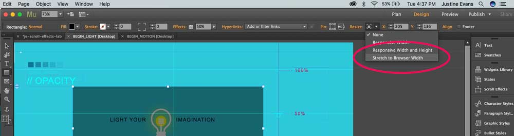
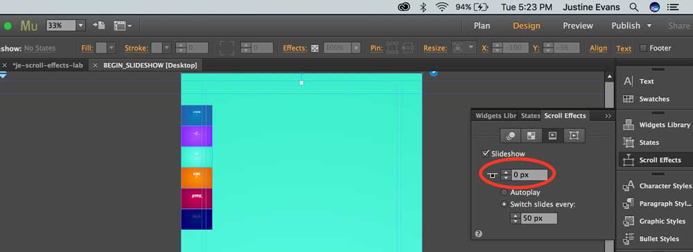

## Lab 03: Scroll Effects in Web Design
/ / / 
/ / / 
/ / / 
/ / /

**Approx. Time to Complete:** 2 hours

For our second lab with Adobe Muse, we're going to have a little fun with scroll effects. Similar to parallax design, scroll effects are a Muse tool that allows you to create dynamic effects for a website. This is a web design technique that enables you to set the speed and direction of each element in your web page as a user interacts with it by scolling.

You can control the motion settings of elements, change the opacity, configure the playback settings of a Slideshow widget, and work with animation content through scroll effects.

View a sample completed site here: [https://justineevansum.github.io/scroll-effects-site/index.html](https://justineevansum.github.io/scroll-effects-site/index.html)

 

<iframe class="embed-responsive-item" src="https://player.vimeo.com/video/237565121?color=FC315A&title=0&byline=0&portrait=0" frameborder="0" allowfullscreen></iframe>

### Getting Started
For this Lab, please follow-along with the Part 1 step-by-step tutorial provided below. In Part 2 you will be asked to add an additional creative feature to make this project unique to you.

1. Visit the example site to get an idea of what you'll be doing!
2. Download the [Project Files](../files/scroll-effects-lab.zip).
3. Open the Muse file "scroll-effects-lab.muse" and begin with Part 1.

### Part 1: Follow Along

#### / MOTION

Select the "MOTION_BEGIN" page to complete the _Speed_ and _Layers_ examples.

##### Speed (04:41)

Scroll Example: <a href="https://justineevansum.github.io/scroll-effects-site/motion.html#speed" target="_blank"> Speed</a>

<iframe class="embed-responsive-item" src="https://player.vimeo.com/video/237562503?color=FC315A&title=0&byline=0&portrait=0" frameborder="0" allowfullscreen></iframe>

##### Layers (06:05)
Scroll Example: <a href="https://justineevansum.github.io/scroll-effects-site/motion.html#layers" target="_blank"> Layers</a>

<iframe class="embed-responsive-item" src="https://player.vimeo.com/video/237563291?color=FC315A&title=0&byline=0&portrait=0" frameborder="0" allowfullscreen></iframe>

#### / OPACITY Pt. 1

Select the "LIGHT_BEGIN" page to complete the _Light_ example.

Scroll Example: <a href="https://justineevansum.github.io/scroll-effects-site/light.html" target="_blank"> Light</a>

<iframe class="embed-responsive-item" src="https://player.vimeo.com/video/237563150?color=FC315A&title=0&byline=0&portrait=0" frameborder="0" allowfullscreen></iframe>

**Note:** The toggle "100% Width" is now found by selecting "Resize" and setting to "Stretch to Browser Width"

#### / TYPOGRAPHY

Select the "TYPE_BEGIN" page to complete the _Scramble_ example.

Scroll Example: <a href="https://justineevansum.github.io/scroll-effects-site/type.html" target="_blank"> Scramble</a>

<iframe class="embed-responsive-item" src="https://player.vimeo.com/video/237562170?color=FC315A&title=0&byline=0&portrait=0" frameborder="0" allowfullscreen></iframe>

#### / SLIDESHOW

Select the "SLIDESHOW_BEGIN" page to complete the _Slideshow_ example.

Scroll Example: <a href="https://justineevansum.github.io/scroll-effects-site/slideshow.html" target="_blank"> Slideshow</a>

<iframe class="embed-responsive-item" src="https://player.vimeo.com/video/237564856?color=FC315A&title=0&byline=0&portrait=0" frameborder="0" allowfullscreen></iframe>

**Note:** If "I Used" is not the first slide to appear, you need to make sure to set the Key Position to 0.

### Part 2: On Your Own

#### Adding Action

Now that you've played around with all of the effects, try completing these other tiles on their associated pages.

- Turn ("BEGIN_MOTION")
- Gravity ("BEGIN_MOTION")
- Jump ("BEGIN_MOTION")
- Formation ("BEGIN_TYPE")
- Slide ("BEGIN_TYPE")
- Opacity Pt. 2 ("BEGIN_OPACITY")
- Slide ("BEGIN_SLIDESHOW")

##### Publish
Please publish your site using Business Catalyst, using the formula **fullname-scroll.businesscatalyst.com/**.

<!--### Master
Scroll effect
scroll bar?

### The About Page
Hot Spots
[Gallery](https://musewidgets.com/collections/widgets/products/carousel-gallery-widget)

### The Pre-Order Page
[Video background](https://musewidgets.com/collections/widgets/products/background-video-widget)-->

<!--We've compared the structure of websites to the principles of traditional architecture, in that the actual design processes are quite similar. But unlike "brick and mortar" structures, websites are not static. They can include a myriad of interactive elements, and should be designed to adapt to user needs, be this screen size, time-sensitive content, or anything else.

Websites, in their easiest definition, act as a communication device between a service and a client. This could be a business and a customer, an artist and a fan, or an educator and a student. Interaction designers

- [Cavalier Challenge](https://cavalierchallenge.com/)
- [Jogg Jeans](http://www.dieseljoggjeans.com/)
- [iFly50](https://iFly50.com)
- [Bolden](http://Bolden.nl)
- [Orangina](http://orangina.eu/home)-->
