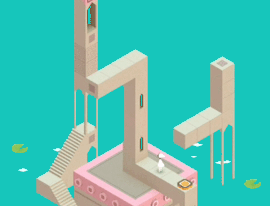

# Conclusions
/ / / 
/ / / 
/ / / 
/ / /

As artists - interactive or otherwise - we need to live in a kind of "design spacial awareness;" a state of being aware not only of the objects around us, but of our relationship to the form and function of these objects.

<i><a href="https://play.google.com/store/apps/details?id=com.ustwo.monumentvalley&hl=en" targe="_blank">Monument Valley</a></i> (2013) is a game that blends spatial design principles with traditional gameplay elements. In fact, while most would call it a game, the creators wanted it considered as a "<b>design experience.</b>"

“The work of M.C. Escher is great and popular because he found a way to describe geometric and spatial concepts through everyday elements like water, buildings and animals. I think what _Monument Valley_ brings to the table is an exploration of how to bring an interactive, emotionally engaging experience to a wide audience through a set of simple mechanics and a world that feels at once familiar and fantastical.” - Designer Ken Wong
