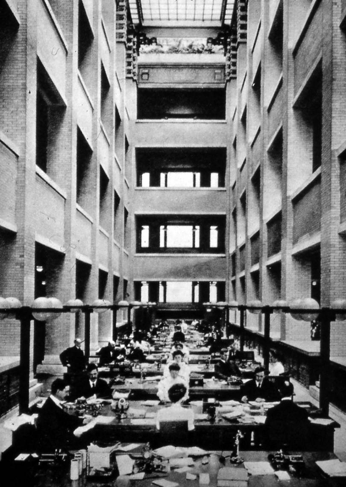

## Traditional Architecture:
/ / / 
/ / / 
/ / / 
/ / /

"Established in 1875, the Larkin Company was a national mail-order business that sold soap products to middle class consumers. Its managers, including John D. Larkin, Elbert Hubbard, Darwin Martin, and William Heath ascribed to the belief that hard work was a moral imperative, and attempted to foster a familial office culture. The construction of a new headquarters was intended to ensure the highest levels of efficiency, productivity, and cooperation among its employees. The mottoes adorning the structure’s balconies and exterior plaques, written primarily by Heath, reinforced these ideals.

Built in 1903, the Larken Administration Building's interior and exterior design and furnishings responded to the daily operations of the company and provided for the welfare of its employees—an early form of air conditioning cooled the space while a communal dining facility, classrooms, and lounge area with a fireplace promoted a congenial office culture." (<a href="http://flwright.org/researchexplore/wrightbuildings/larkincompanyadministrationbuilding">Frank Lloyd Wright Trust</a>)

We owe much to the prolific arhitect **Frank Lloyd Wright** and his work, including the idea that office spaces could enhance the life of its employees. But what of other spaces?

Architecture has always been slow to adapt to new traditions, but with the rise of the sustainability movement and digital technologies, we're seeing architecture becoming _responsive_ and even _interactive_ to the surrounding environment.

It's critical that we explore the philosophy of architecture - old and new - and how it has the potential to be interactive art on the grandest scale.

### Abstract: The Art of Design "Bjarke Ingels on Architecture"
/ **Access:** [NetFlix Streaming](https://www.netflix.com/title/80093807)

"Bjarke Ingels is fond of saying that architecture is “the art of turning fiction into fact.” He boasts many talents—as a draftsman, as a salesman, as the charming cultivator of his own winning image—but his greatest asset is a gift for storytelling: an ability to construct a narrative around practical necessities. Often his designs careen in fantastical directions. He is currently building a waste-to-energy plant in Copenhagen with a slanted roof that will serve as a recreational ski slope and a smokestack that will puff a symbolic ring of steam each time it emits a ton of carbon dioxide. For a proposed expansion of Google’s campus in Mountain View, California, Ingels (along with collaborator Thomas Heatherwick) created a wildly elaborate complex of geodesic domes, envisioning a lifestyle of biking, hiking, and coding inside a sunlit glass terrarium. Such imaginative flights have made Ingels famous—and highly sought-after—at an age considered precocious by architecture standards." (via [Wired](https://www.wired.com/2015/09/bjarke-ingels-2-world-trade-center-wtc-2))

<iframe class="embed-responsive-item" src="https://www.youtube.com/embed/vv07HmXDu-w" frameborder="0" allowfullscreen></iframe>

