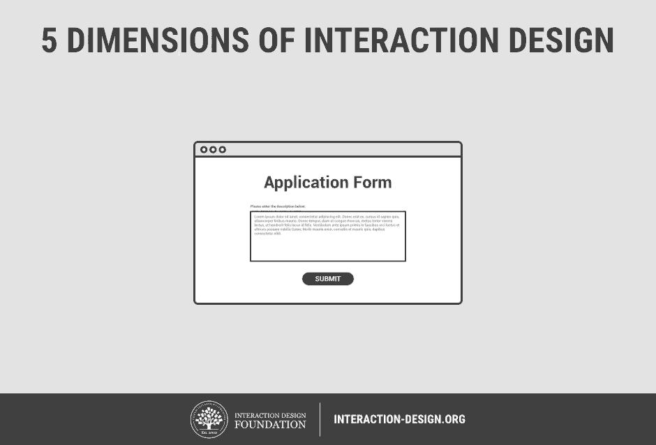

## InterACTION:
/ / / 
/ / / 
/ / / 
/ / /

"Interaction Design (IxD) defines the structure and behavior of interactive systems. Interaction designers strive to **create meaningful relationships between people and the products and services that they use**, from computers to mobile devices to appliances and beyond. Our practices are evolving with the world." ([The Interaction Design Association](http://www.ixda.org/about/ixda-mission) (IxDA))

### "What is IxD?"

Please read this short article on the [5 Dimensions of Interaction Design](https://www.interaction-design.org/literature/article/what-is-interaction-design) by Teo Siang.

