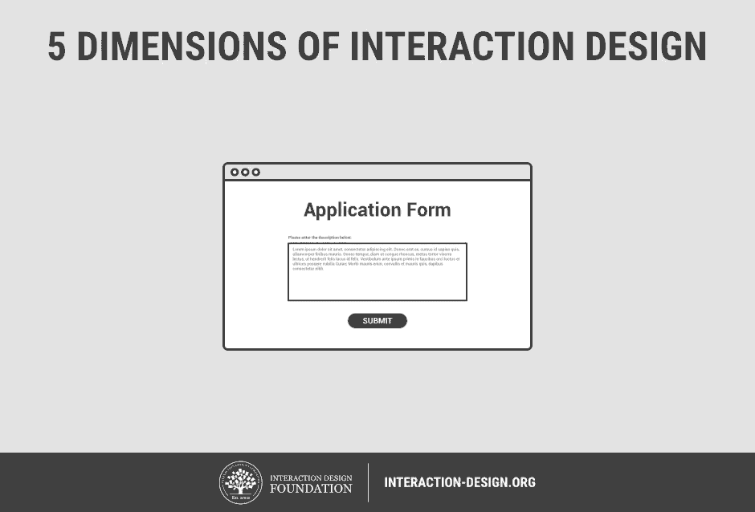

## 5 Dimensions of IxD:
/ / / 
/ / / 
/ / / 
/ / /

Many fields practice some facet of interaction design. It's a global theology in the technical arts, notably those requiring screens and artifical processes (like software and projections). Let's focus on IxD in this sense, particularly with web design and applications.

We don't have time to go over all of the previous methodologies in IxD, so let's just look at one of the more practical practices. Please read this short article on the [5 Dimensions of Interaction Design](https://www.interaction-design.org/literature/article/what-is-interaction-design) by Teo Siang.

