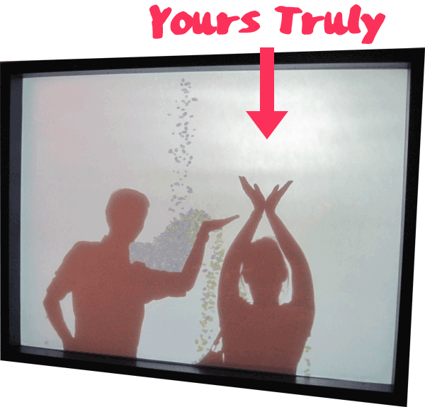

## The Beauty of 1s and 0s:
/ / / 
/ / / 
/ / / 
/ / /

### A New Aesthetic for the Digital Age
As the 21st-century generation of artistic innovators explore untapped territory and create new aesthetic environments and experiences, our aesthetic sensibilities begin to evolve as well.

The expansion of a visual and sonic language engrained in a increasingly networked culture affords us the opportunity to continually reassess the role of creation, participation and meaning and our relationship to it. One example is the "New Aesthetic,"" a term coined by James Bridle that refers to the increasing appearance of the visual language of digital technology and the Internet in the physical world, and the blending of virtual and physical.

Since we are clearly in an era of convergence it is critical that we maintain a holistic overview of the aesthetic experiences that this new paradigm offers.

<iframe class="embed-responsive-item" src="https://player.vimeo.com/video/239828561?color=FC315A&title=0&byline=0&portrait=0" frameborder="0" allowfullscreen></iframe>

<a href="https://player.vimeo.com/video/239828561?color=FC315A&title=0&byline=0&portrait=0" target="_blank"><i>View Larger</i></a>

### From Reaction to Interaction

"**Interactive Art** describes art that relies on the participation of a spectator. These can be physical pieces like sculpture, and computer-based processs like those found in interactive installations." (via [the Tate](http://www.tate.org.uk/art/art-terms/i/interactive-art))

Fifty years ago when someone would walk through the galleries of an art museum, they would interact with the work in a very personal way. Standing in front of a Picasso or DeKooning the eye would move around the canvas and an internal process, based on a number of cultural and artistic factors, would begin to affect the viewer and expand their aesthetic perspective. But the work didn’t essentially change.

At the end of the 20th century, however, the rapid development of digital computation began to offer artists the possibility of allowing the viewers themselves to affect the actual physical manifestation of the work, which now made them part of the production of the art and not just receivers of it. This is a dramatic change. It does not diminish the profound beauty of the generations of artists who came before, but by using sophisticated software platforms and programs, these interactive media artists are exploring and redefining the relationship between the artist and viewer in new and exciting ways.

<iframe class="embed-responsive-item" src="https://player.vimeo.com/video/239831520?color=FC315A&title=0&byline=0&portrait=0" frameborder="0" allowfullscreen></iframe>

<a href="https://player.vimeo.com/video/239831520?color=FC315A&title=0&byline=0&portrait=0" target="_blank"><i>View Larger</i></a>

