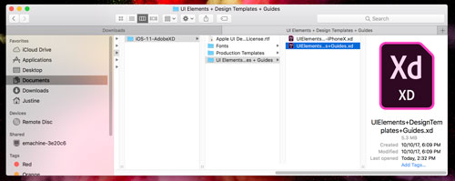
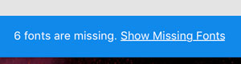
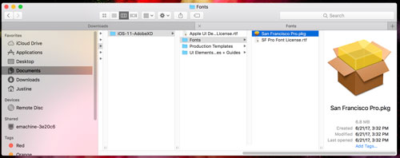
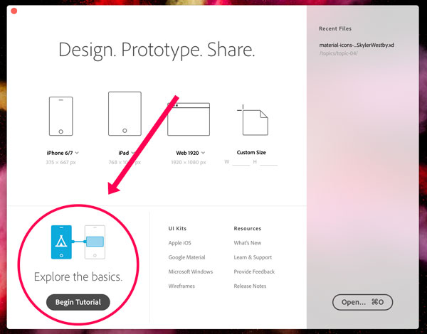
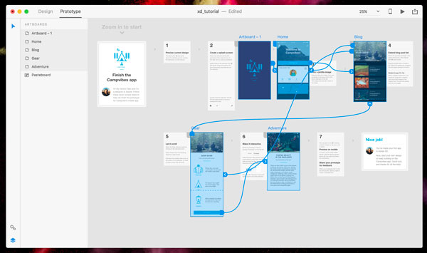
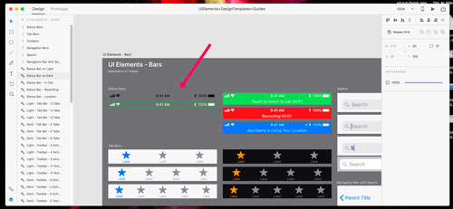
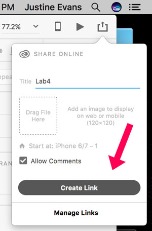

## Lab 04: Lo-Fi Protoyping (The Banking App)
/ / / 
/ / / 
/ / / 
/ / /

**Approx. Time to Complete:** 3 hours

Together using Adobe Xd, we're going to build a few app prototypes that will focus on **intuative features**, **graphics**, and designing **flow.** Please make sure you have installed or have access to Adobe Xd.

This first Lab is for an example banking application for mobile.

View a sample completed prototype here: [Sound Personal Banking App](https://xd.adobe.com/view/6c845177-c5a9-4fca-8046-d0d645cf8c11/)

 

<iframe class="embed-responsive-item" src="https://player.vimeo.com/video/239878247?color=FC315A&title=0&byline=0&portrait=0" frameborder="0" allowfullscreen></iframe>

App Guide

### Getting Started
For this Lab, please follow-along with the Part 1 step-by-step tutorial provided below. In Part 2 you will be asked to add an additional creative feature to make this project unique to you.

1. Visit the example site to get an idea of what you'll be doing!
2. Download the [Material Icons](../files/material-icons-for-lab.zip) we'll be using (adapted from Skyler Westby).
3. Download the appropriate iOS Apps UI set from [AppleDeveloper](https://developer.apple.com/design/resources/#ios-apps).
   - Open up the file "UIElements+DesignTemplates+Guides.xd."
   

   - You may see that you have "missing" fonts:
   

   - If so, return to the package and install the included fonts:
   

   - You'll be using this file later, but you can close it now if you prefer.
4. _Please read ahead to the "[On Your Own](./#own)" section before you begin!_ You need to create your own graphics for this app, and you may want to think about that first.

### Part 1: Follow Along

#### / On-Screen Tutorial
To begin, open Adobe Xd and follow along with the in-app tutorial. This will take approximately 10 minutes, and you'll be glad you did!

<b>NOTE:</b> If you're looking for the "hand" or tool to pan with like in Photoshop or Illustrator, hold the <i>SPACE BAR</i> down to grab and direct the canvas.

#### / The Banking App

This is spit into two main sectins, wireframing and

##### Wireframing (0:53 - 38:20)

The first stage of desing is wireframing, where the basic blocks and elements of the design are laid out and arranged for functionality (not style).

##### The UI Kit (14:45)

At this point, your interface may look different. If **File > Get UI Kits > Apple iOS...** _does not_ load, open up the "UIElements+DesignTemplates+Guides.xd" you downloaded earlier.

Use the Status Bar icons found in the "UI Elements - Bar" artboard.

##### Lo-Fi Design (41:00 - End)

This second stage will give you the opportuity to add some simple graphics and a basic color palette, but it should not be very graphacially-heavy.

On you're own:
- Create a logo. This can be through a decorative font or a graphic.
- Find three stock images of people.
- Create a background for this iPhone app 1334x750.

<h3 id="own" span style="color: #FC315A; font-weight: bold;">Part 2: On Your Own</h3>
To complete this lab, please complete these following steps on your own:

- Create your own logo for a fake banking application. You can choose to use a fancy font instead.
- Find 2-3 stock images for your "user" profiles.
- Create or source a background for the app. It should be at least 375 x 667 pixels for an iPhone 6/7 app.

##### Publish
Follow along with the video to publish your prototype. You will turn-in this link on Moodle.

