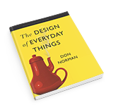

## Art for a New Age:
/ / / 
/ / / 
/ / / 
/ / /

"There is no reason for these backward designs to persist, since various working solutions to the problem already exist, and yet these horrible doors are still all around us in the built environment.

This peculiar design problem is part of what motivated Don Norman (hence: "Norman Door") to write his now-classic book _[The Design of Everyday Things](https://en.wikipedia.org/wiki/The_Design_of_Everyday_Things)_. Similar issues can be found in other everyday objects as well, from light switches and sink handles, which frequently feature counter-intuitive functions or modes of operation.

An advocate of user-centric (or: people-oriented) design, Norman offers insights that bring together aspects of usability, engineering, and cognitive science. His book provides an enlightening look into the intersection of these disciplines and design, informative and educational for users and designers alike."

### Abstract: The Art of Design "Episode 01: Christoph Niemann on Illustration"
/ **Access:** [NetFlix Streaming](https://www.netflix.com/title/80093807)

"I still remember being a student in the late 1990s and having vivid discussions with friends who doubted that designers would one day have to be able to operate computers and believed that this whole hype would quickly blow over. Being a maverick feels nice. But just because a client kills my sketch or something gets no likes on Facebook, it doesn’t necessarily mean it’s a masterpiece that’s ahead of its time.

"Maybe it’s just bad." 

<iframe class="embed-responsive-item" src="https://player.vimeo.com/video/239813353?color=FC315A&title=0&byline=0&portrait=0" frameborder="0" allowfullscreen></iframe>

<a href="https://player.vimeo.com/video/239813353?color=FC315A&title=0&byline=0&portrait=0" target="_blank"><i>View Larger</i></a>

